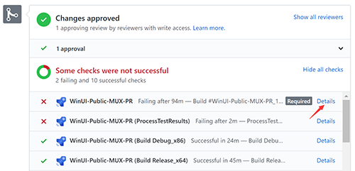
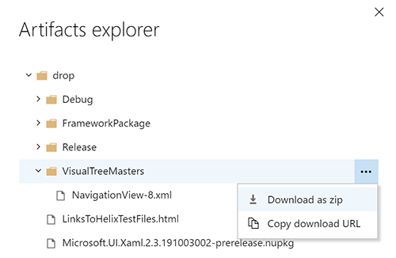

# Developer Guide

This guide provides instructions on how to build the repo and implement 
improvements.

* [Prerequisites](developer_guide.md#Prerequisites)
* [Building the repository](developer_guide.md#Building-the-repository)
* [Testing](developer_guide.md#Testing)
* [Telemetry](developer_guide.md#Telemetry)

Additional reading:

* [Source code structure](source_code_structure.md)
* [Coding style and conventions](code_style_and_conventions.md)


## Prerequisites
#### Visual Studio

Install latest VS2019 (16.1 or later) from here: http://visualstudio.com/downloads

#### SDK

While WinUI is designed to work against many versions of Windows, you will need 
a fairly recent SDK in order to build WinUI. It's required that you install the 
17763 and 18362 SDKs. You can download these via Visual Studio (check 
all the boxes when prompted), or you can manually download them from here: 
https://developer.microsoft.com/en-US/windows/downloads/windows-10-sdk

<!-- 
You will also need to install The Windows 10 Insider SDK 18323. The easiest way 
to install this is to run the Install-WindowsSdkISO.ps1 script from this repo in
an Administrator Powershell window:

 `.\build\Install-WindowsSdkISO.ps1 18323` -->

## Building the repository

Generally you will want to set your configuration to **Debug**, **x64**, and 
select **MUXControlsTestApp** as your startup project in Visual Studio.

### Creating a NuGet package

> More information will be coming on this soon

## Testing

### Validating UI and accessibility requirements

> More information will be coming on this soon

### Manual testing

#### Test app

The WinUI solution project has a test app that is useful for validating common 
scenarios affected by the presence of the WinUI package.  Set 
**MUXControlsTestApp** as your startup project in Visual Studio and you can F5 
to start debugging that app and validate your changes.

##### Organization

MUXControlsTestApp is a no frills test app built for on demand developer 
scenarios and also to be automation friendly. As such it's perhaps not as 
friendly to navigate as something similarly control-centric like the 
[Xaml Controls Gallery](https://github.com/Microsoft/Xaml-Controls-Gallery/). 
That's a great potential area for future improvement, although 
MUXControlsTestApp must continue to function as an automation test target. 

#### Standalone app targeting custom NuGet package

In the end developers will consume WinUI as a NuGet package in their own apps. 
So it's important to keep in mind that scenario when validating changes.

To enable **automated** NuGet package testing there is a separate solution at 
test\MUXControlsReleaseTest\MUXControlsReleaseTest.sln, which contains
MUXControls.ReleaseTest, NugetPackageTestApp (C#) and NugetPackageTestAppCX 
(C++).

Test classes for this are in MUXControls.ReleaseTest, and they share test 
infrastructure with MUX so you can write tests in the same way as in MUX. 
The only difference is you’ll have to specify the TestType in ClassInitialize 
and TestCleanup (TestType.Nuget for NugetPackageTestApp and TestType.NugetCX 
for NugetPackageTestAppCX). 
```
public static void ClassInitialize(TestContext testContext)
{
    TestEnvironment.Initialize(testContext, TestType.Nuget);
}

public void TestCleanup()
{
    TestEnvironment.AssemblyCleanup(TestType.Nuget);
}
```
The test apps are using released versions of MUX NuGet package locally. In [CI](https://dev.azure.com/ms/microsoft-ui-xaml/_build?definitionId=20), 
the test pipeline will generate a NuGet package for each build, and there’s a 
separate pipeline configured to consume the generated package from latest 
build and run MUXControl.ReleaseTest.

#### Downlevel testing

One of the core values of WinUI is the way that it brings controls to a wide 
variety of versions of Windows, handling version compatibility differences so 
that developers using WinUI don't have to. As such, testing WinUI changes on 
different versions is sometimes necessary. To accomplish this you will need to 
at times set up older versions of Windows for testing. To get these earlier 
versions you can make use of a Visual Studio subscription [as described here](https://docs.microsoft.com/azure/virtual-machines/windows/client-images).

### Automated testing

You can run the test suite from within Visual Studio by using the Test top 
level menu. For targeting indivual tests you can use [Test Explorer](https://docs.microsoft.com/en-us/visualstudio/test/run-unit-tests-with-test-explorer?view=vs-2019) 
(found under the Test->Windows sub menu).

This same suite of tests will be run as part of your Pull Request validation 
[check](contribution_workflow.md#Checks).

#### Creating a new test

For your test to be discovered it needs to be a method tagged as [\[TestMethod\]](https://docs.microsoft.com/en-us/dotnet/api/microsoft.visualstudio.testtools.unittesting.testmethodattribute?view=mstest-net-1.2.0) 
on a class tagged with as [\[TestClass\]](https://docs.microsoft.com/en-us/dotnet/api/microsoft.visualstudio.testtools.unittesting.testclassattribute?view=mstest-net-1.2.0). 
With that metadata in place your new test method will be picked up by Test 
Explorer.

There are two types of tests you can use to validate your scenarios:
* **API Tests**: Run in the context of an app and validate the behaviors of our 
APIs. 
* **Interaction Tests**: Drive the UI on an external app and validate the 
results using UI Automation.

Keep in mind that your test will be executed on many different versions of 
Windows, not just the most recent version. Your tests may need version or 
[IsApiPresent](https://docs.microsoft.com/en-us/uwp/api/windows.foundation.metadata.apiinformation.istypepresent) 
checks in order to pass on all versions.

#### Updating visual tree masters
Visual tree dumps are stored [here](https://github.com/microsoft/microsoft-ui-xaml/tree/master/test/MUXControlsTestApp/master) and we use them as the baseline (master) for visual tree verifications. If you make UI changes, visual tree verification tests may fail since the new dump no longer matches with masters. The master files need to be updated to include your latest changes. Visual verification test automatically captures the new visual tree and uploads the dump to test pipeline artifacts. Here are the steps to replace existing masters with the new ones.

1. Find your test build.

    
    

2. Download new masters.

    
    

3. Diff & replace

    Diff the [old](https://github.com/microsoft/microsoft-ui-xaml/tree/master/test/MUXControlsTestApp/master) and new masters, make sure the changes are intended, replace the files and commit your changes.

## Telemetry

This project collects usage data and sends it to Microsoft to help improve our 
products and services. Note however that no data collection is performed by default
when using your private builds. An environment variable called "EmitTelemetryEvents"
must be defined during the build for data collection to be turned on.

When using the Build.cmd script, you can use its /EmitTelemetryEvents option to define
that variable.
Or when building in Visual Studio, you can first define the environment variable in a
Command Prompt window and then launch the solution from there:

1. In a Command Prompt window, set the required environment variable: set EmitTelemetryEvents=true
2. Then from that same Command Prompt, open the Visual Studio solution: MUXControls.sln
3. Recompile the solution in Visual Studio. The build will use that environment variable.
